<h1 align="center">
  Tabi旅Time<br>
  <small>Your Personal Nihon Travel Nexus & Dashboard</small>
</h1>

## 📄 Overview
**Tabi旅Time** is the culmination of my repeated travels across Japan. Having visited the archipelago multiple times for vacation, I noticed a recurring challenge: the digital fragmentation of memories. Photos, GPS coordinates, and travel logs often end up scattered across different cloud services and devices. 

I built this system to act as a centralized, private command center for my upcoming journeys. Stationed on a **Raspberry Pi 5** in my home in the United States, the dashboard remains globally accessible via a **Tailscale** mesh network. Whether I am navigating the crowded streets of Shinjuku or hiking the rural trails of Kumano Kodo, I can securely beam data back to my home server in America from across the world.

Beyond personal utility, TabiTime serves as a **Live Spectator Portal**. By sharing specific nodes via Tailscale, my family members can securely access the dashboard in real-time, following my GPS progress and viewing high-res gallery updates as they happen—staying connected across continents without the need for public social media.

---

### 🛠️ Tech Stack
<p align="center">
    
    
    
    
    <br>
    
    
    
</p>

---

## 🚀 Key Features

### 🖥️ Dashboard
<p align="center">
  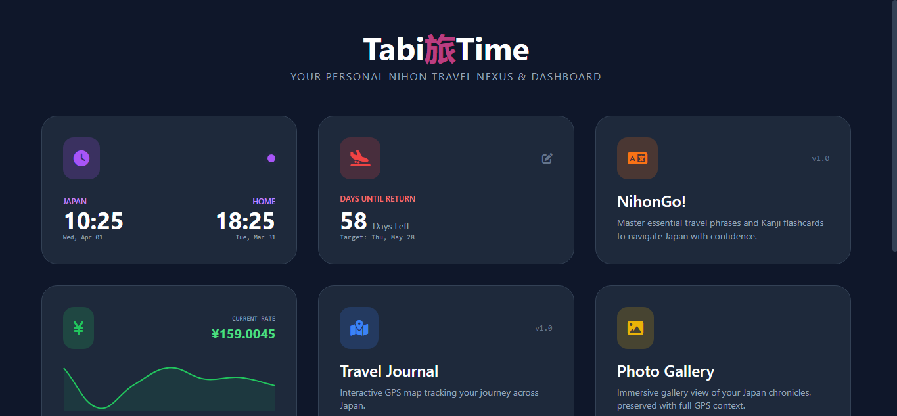
  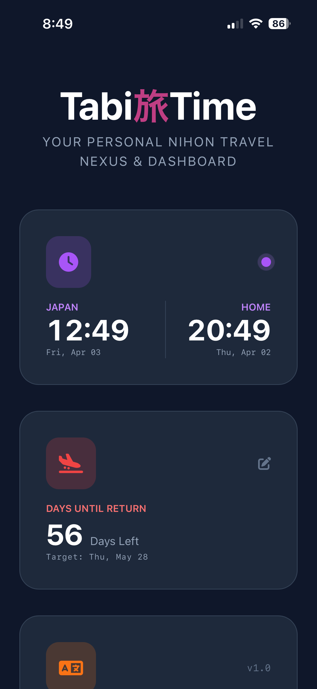
</p>

The core interface serves as a high-level overview of the trip's status. Engineered with **Mobile-First Responsiveness**, the layout utilizes a dynamic Tailwind grid that adapts from a 3-column desktop view to a single-column stacked mobile view, ensuring critical travel data is accessible on the go.

---

### 🕒 Dual-Zone Clock & 📅 Trip Countdown
<p align="center">
  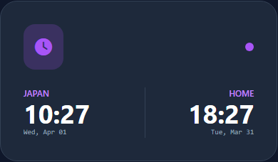
  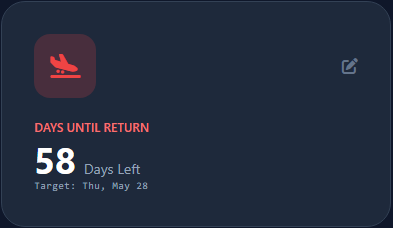
</p>

- **Real-Time Temporal Sync:** Displays live time and date for both **Japan (JST)** and **Home (PST)** to mitigate jet lag and coordinate home-calls.
- **Persistent State:** The countdown utilizes `localStorage` to preserve return dates without backend overhead, featuring a touch-optimized modal for date entry.

---

### 🍱 NihonGo!
<p align="center">
  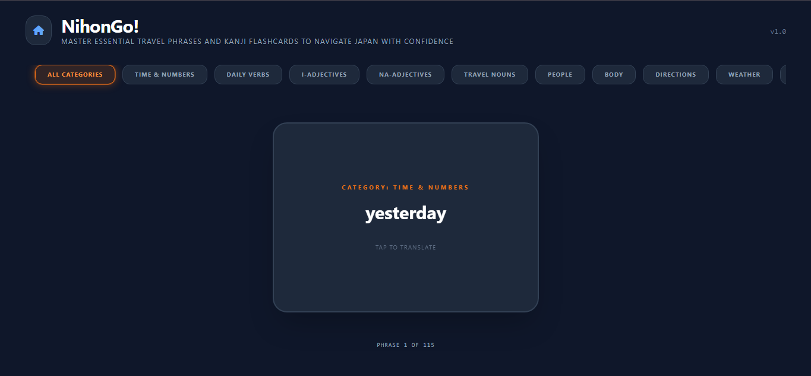
  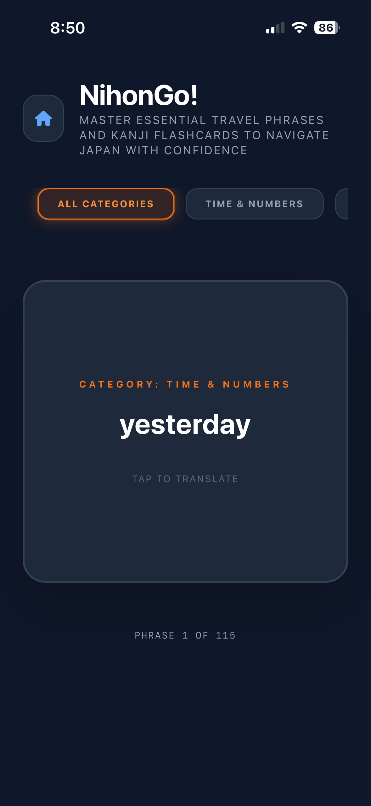
  
</p>

- **JLPT N5 Mastery:** Features an curated database of 400+ high-frequency flashcards specifically targeting the **JLPT N5** exam, covering core Kanji, Grammar Particles, and Essential Verbs.
- **Interactive 3D Flip:** Utilizes CSS `perspective` and `backface-visibility` to create a realistic 3D card-flip animation, mimicking physical study habits.
- **Fisher-Yates Shuffle:** Integrated JavaScript logic allows for randomized Deck Shuffling, preventing rote memorization based on card order and ensuring true retention.
- **Smart Categorization:** A dynamic filtering system allows users to focus on specific vocabulary groups, such as **Time & Numbers**, **Na-Adjectives**, or **Travel Essentials**.

### ✍️ Customizing Your Deck
The **NihonGo!** engine is entirely data-driven, making it easy to scale as your proficiency grows. To add new cards or customize your study path, simply modify the `static/data/phrases.json` file. 

For my current 2026 trip, I am heavily focused on the **JLPT N5** curriculum, so the deck is pre-loaded with N5 essentials. Each entry follows this simple schema:

```json
{
  "id": 116,
  "category": "Daily Verbs",
  "kanji": "走る",
  "romaji": "hashiru",
  "english": "to run"
}
```

---

### 💴 Currency Converter
<p align="center">
  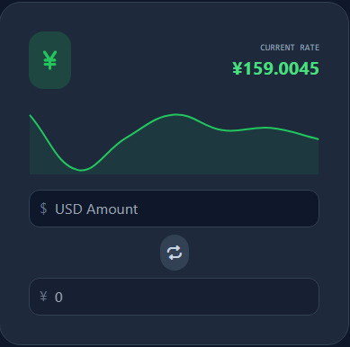
  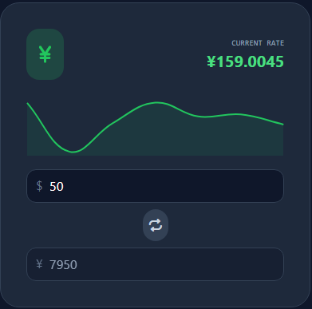
  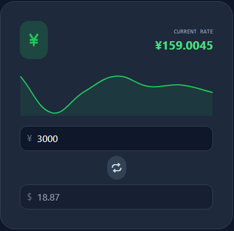
</p>

- **Live Rate Integration:** Pulls the current USD/JPY exchange rate via API to ensure financial accuracy.
- **Visual Trends:** Integrated **Chart.js** visualization displays recent rate fluctuations.
- **Instant Swapping:** Sleek interface supports immediate input swapping (USD ⇄ JPY) with automatic recalculation.

---

### 🗺️ Travel Journal
<p align="center">
  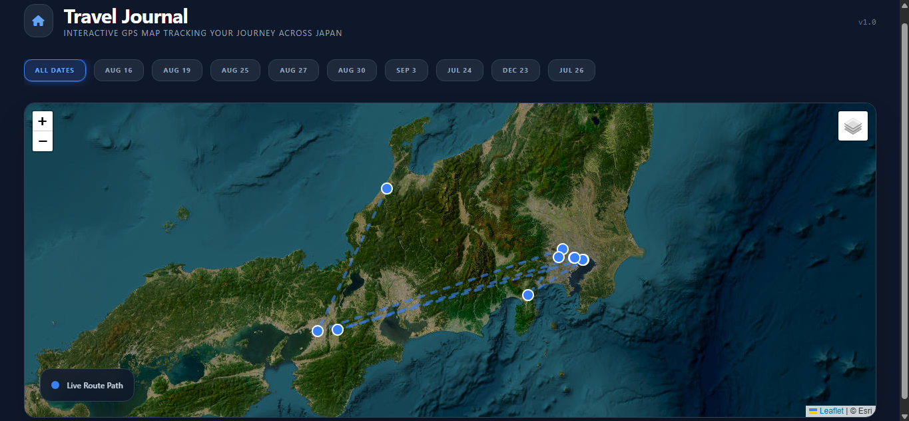
  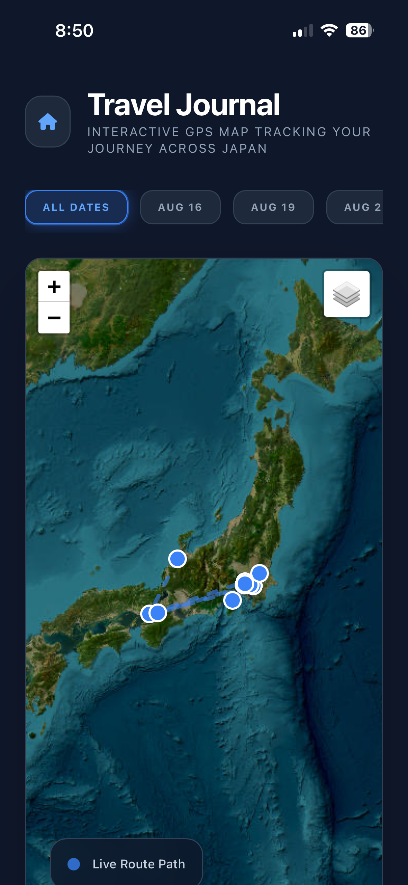
</p>

- **Satellite Context:** Utilizes high-resolution **Satellite View** as the primary layer for photorealistic environmental context.
- **Chronological Trace:** Maps the journey as a connected path, highlighting movement across the Japanese archipelago.
- **Temporal Filtering:** Supports dynamic date toggling to focus the map visualization exclusively on waypoints and media captured on specific days.
<p align="center">
  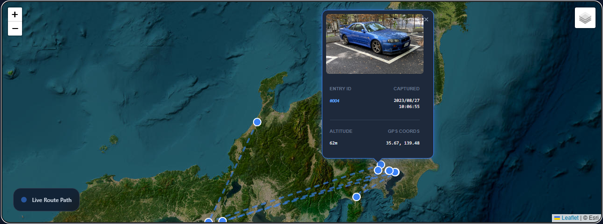
</p>

- **Waypoint Intelligence:** Each coordinate point features a custom popup detailing **Entry ID**, **Captured Time**, **Altitude**, and **GPS Accuracy**, including a preview of the media captured at that location.
<p align="center">
  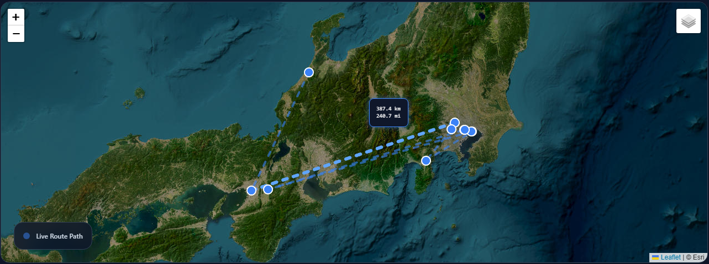
</p>

- **Haversine Distance Mapping:** Interactive polylines calculate the exact distance between waypoints in both kilometers and miles, providing real-time trip mileage statistics upon hover.
<p align="center">
  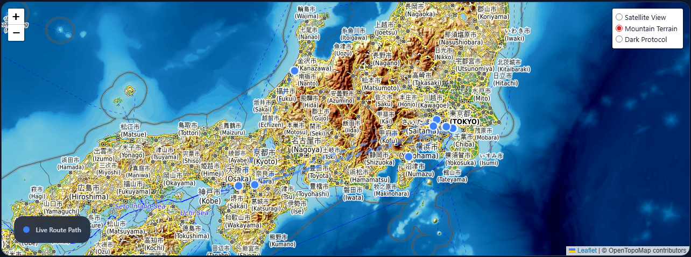
</p>

- **Dynamic Topography:** Includes an **OpenTopoMap** layer to visualize elevation and terrain data, essential for tracking hiking and mountain treks.
<p align="center">
  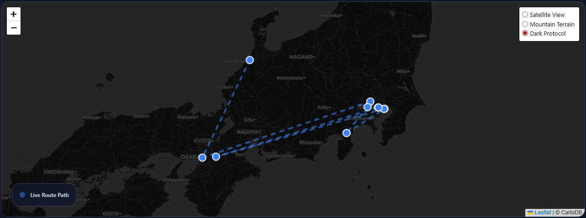
</p>

- **High-Contrast Navigation:** Features a **Dark Protocol** layer (CartoDB) for a sleek, technical UI that minimizes eye strain.

### 📸 Photo Gallery
<p align="center">
  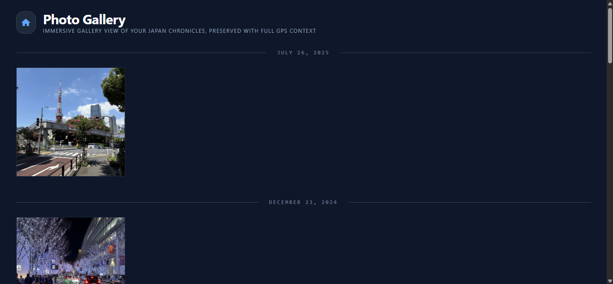
  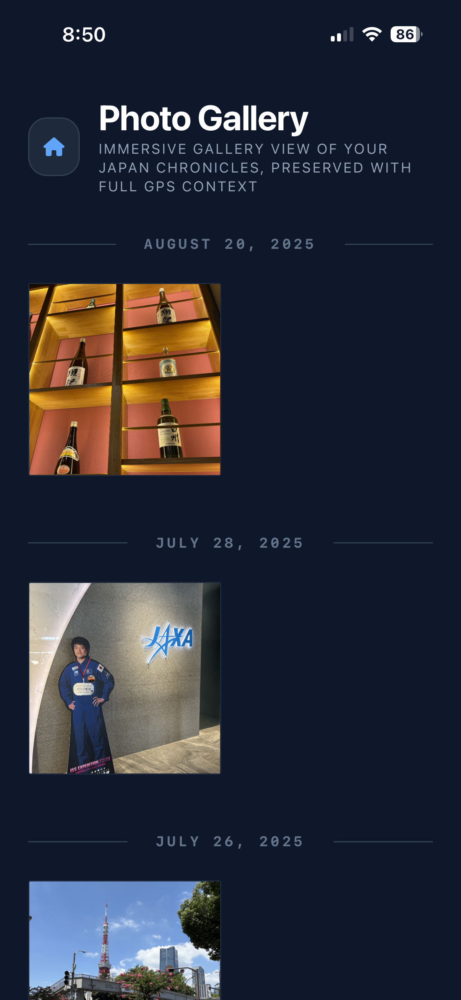
</p>

- **Zero-Touch P2P Pipeline:** Displays photosSynced directly from iPhone via the Syncthing/Tailscale pipeline over a WireGuard mesh network.
- **Event-Driven Assembly:** Watchdog services trigger automated EXIF parsing and HEIC-to-JPG conversion upon arrival, populating the gallery in real-time.
<p align="center">
  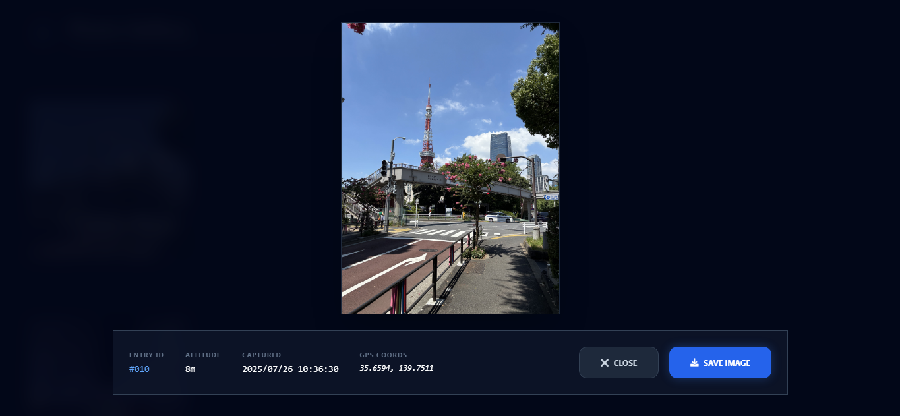
</p>

- **HCI Lightbox Engineering:** A custom-built image viewer with Thumb Zone ergonomics, placing critical **Close** and **Save** actions at the bottom of the screen for seamless one-handed mobile navigation.
- **Metadata Overlays:** Overlays technical EXIF data on every image, providing exact context for **Altitude**, **GPS Coordinates**, and **Timestamp**.

---

## 🏗️ System Architecture & Data Pipeline

**TabiTime** is engineered as a private, distributed system that bridges the gap between mobile hardware and home-based edge servers. The power of the platform lies in its zero-touch automated synchronization and processing engine.

### 1. Data Capture & P2P Synchronization
The pipeline begins the moment a photo is captured on an iPhone. 
* **iOS Preparation:** Utilizing the **MobiusSync** app (an iOS wrapper for Syncthing), a peer-to-peer connection is established with the Raspberry Pi. 
* **The Mesh Network:** To bypass firewalls while traveling in Japan, **Tailscale** (WireGuard) creates a secure, encrypted tunnel between the mobile device and the **Raspberry Pi 5** stationed in the US.
* **Transmission:** High-resolution HEIC files are beamed across the world directly to the Pi's local storage.

### 2. Event-Driven Watcher Service
Rather than using a slow, scheduled cron job, TabiTime uses an **event-driven** model to ensure the dashboard updates in real-time.
* **File Monitoring:** A Python service using the `watchdog` library monitors the landing directory on the Pi.
* **Atomic Handling:** Because Syncthing creates temporary files during transit, the service is engineered to ignore partial writes and only trigger once the file move is finalized via the `on_moved` event.

### 3. Metadata Extraction & Transformation
Once a file is detected, the `exif_parser.py` engine takes over:
* **ExifTool Integration:** The system shells out to a Perl-based **ExifTool** binary. This was a critical engineering choice, as standard Python libraries (like `Pillow`) often strip or fail to read the complex, nested GPS metadata found in Apple's HEIC containers.
* **Data Normalization:** Coordinates are converted from DMS (Degrees, Minutes, Seconds) to Decimal Degrees and stored in a central `points.json` database.
* **Web Optimization:** The heavy HEIC files are non-destructively converted to optimized JPGs to ensure sub-second rendering on the web dashboard.

### 4. Global Dashboard Access
The final layer is a **Flask** web server that provides the user interface.
* **Client-Side Rendering:** The dashboard pulls the normalized JSON and renders the interactive journey using **Leaflet.js** and **Tailwind CSS**.
* **Remote Viewing:** Because of the Tailscale mesh, family members can access this local Flask server from their own devices as if it were a public website, while the data remains entirely sovereign on my personal hardware.

---

## 🏁 Prerequisites & Installation

Coming Soon!

---

<p align="center">
  &copy; 2026 <a href="https://alexryse.com">Alex Ryse</a> | Built for Japan <span style="color: #ec4899;">旅</span><br>
  <em>Powered by Raspberry Pi 5 & Syncthing Automation</em>
</p>
